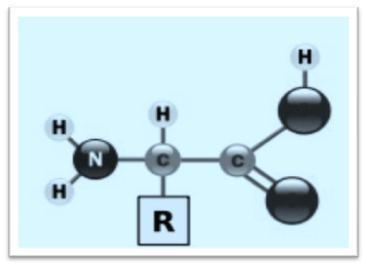
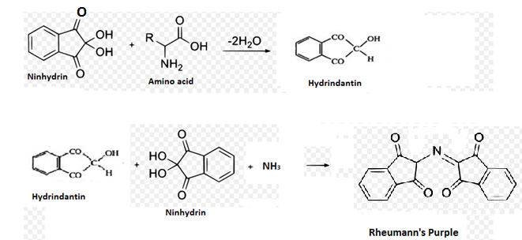
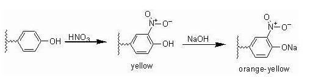
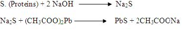

### Theory:
 
 
Amino acids are building blocks of all proteins, and are linked in series by peptide bond (-CONH-) to form the primary structure of a protein. Amino acids possess an amine group, a carboxylic acid group and a varying side chain that differs between different amino acids.

There are 20 naturally occurring amino acids, which vary from one another with respect to their side chains. Their melting points are extremely high (usually exceeding 200°C), and at their pI, they exist as zwitterions, rather than as unionized molecules.

Amino acids respond to all typical chemical reactions associated with compounds that contain carboxylic acid and amino groups, usually under conditions where the zwitter ions form is present in only small quantities. All amino acids (except glycine) exhibit optical activity due to the presence of an asymmetric α – Carbon atom. Amino acids with an L – configuration are present in all naturally occurring proteins, whereas those with D – forms are found in antibiotics and in bacterial cell walls.

&nbsp;

 

   Fig 1.  Structure of amino acid

&nbsp;

### Principle:
 

Ninhydrin test

 

 In the pH range of 4-8, all α- amino acids react with ninhydrin (triketohydrindene hydrate), a powerful oxidizing agent to give a purple colored product (diketohydrin) termed Rhuemann’s purple. All primary amines and ammonia react similarly but without the liberation of carbon dioxide. The imino acids proline and hydroxyproline also react with ninhydrin, but they give a yellow colored complex instead of a purple one. Besides amino acids, other complex structures such as peptides, peptones and proteins also react positively when subjected to the ninhydrin reaction.

 &nbsp;

 

&nbsp;

Xanthoproteic acid test

 Aromatic amino acids, such as Phenyl alanine, tyrosine and tryptophan, respond to this test. In the presence of concentrated nitric acid, the aromatic phenyl ring is nitrated to give yellow colored nitro-derivatives. At alkaline pH, the color changes to orange due to the ionization of the phenolic group.

 &nbsp;

 &nbsp;

Pauly's diazo Test

 This test is specific for the detection of Tryptophan or Histidine. The reagent used for this test contains sulphanilic acid dissolved in hydrochloric acid. Sulphanilic acid upon diazotization in the presence of sodium nitrite and hydrochloric acid results in the formation a diazonium salt. The diazonium salt formed couples with either tyrosine or histidine in alkaline medium to give a red coloured chromogen (azo dye).

 &nbsp;

Millon's test

Phenolic amino acids such as Tyrosine and its derivatives respond to this test. Compounds with a hydroxybenzene radical react with Millon’s reagent to form a red colored complex. Millon’s reagent is a solution of mercuric sulphate in sulphuric acid.

 &nbsp;

 Histidine test

 

This test was discovered by Knoop. This reaction involves bromination of histidine in acid solution, followed by neutralization of the acid with excess of ammonia.  Heating of alkaline solution develops a blue or violet coloration.

 &nbsp;

Hopkins cole test

This test is specific test for detecting tryptophan. The indole moiety of tryptophan reacts with glyoxilic acid in the presence of concentrated sulphuric acid to give a purple colored product. Glyoxilic acid is prepared from glacial acetic acid by being exposed to sunlight.

 

 &nbsp;

Sakaguchi test

 

Under alkaline condition, α- naphthol (1-hydroxy naphthalene) reacts with a mono-substituted guanidine compound like arginine, which upon treatment with hypobromite or hypochlorite, produces a characteristic red color.

 

 &nbsp;

Lead sulphide test

 

Sulphur containing amino acids, such as cysteine and cystine. upon boiling with sodium hydroxide (hot alkali), yield sodium sulphide. This reaction is due to partial conversion of the organic sulphur to inorganic sulphide, which can detected by precipitating it to lead sulphide, using lead acetate solution.

  &nbsp;

  &nbsp;

Folin's McCarthy Sullivan Test

 Imino acids such as Proline and hydroxyproline condense with isatin reagent under alkaline condition to yield blue colored adduct. Addition to sodium nitroprusside[Na2Fe(CN)5NO]  to an alkaline solution of methionine followed by the acidification of the reaction yields a red colour. This reaction also forms the basis for the quantitative determination of methionine.  

 

  &nbsp;

Isatin test

 

Imino acids such as Proline and hydroxyproline condense with isatin reagent under alkaline condition to yield blue colored adduct.